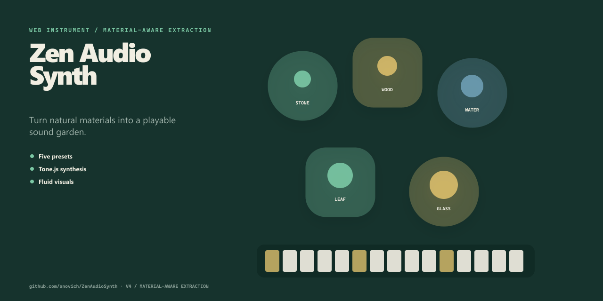

# ZenAudioSynth

[English](README.md)

把自然材质预设变成可演奏声音庭园的侘寂风浏览器乐器。



**[在线体验](https://onovich.github.io/ZenAudioSynth/)**

## 项目包含什么

- 五种材质预设。
- Tone.js 合成。
- 流体视觉。

## 快速开始

安装依赖并启动本地版本：

```bash
npm install
npm run dev
```

仓库还提供 `npm run build`。

## 仓库结构

- `src/` — 应用与库的源代码。
- `origin/` — 原始原型与设计资料。
- `.github` — 自动化与 GitHub Pages 工作流。
- `index.html` — Web 入口。
- `package.json` — 包脚本与依赖。

## 文档

- [`origin/design.md`](origin/design.md)

## 当前状态

仓库已经包含与上述用途对应的实现和项目材料。当前仓库没有自动化测试，评估时请在目标环境中直接运行。

## 许可证

当前仓库未包含开源许可证。
